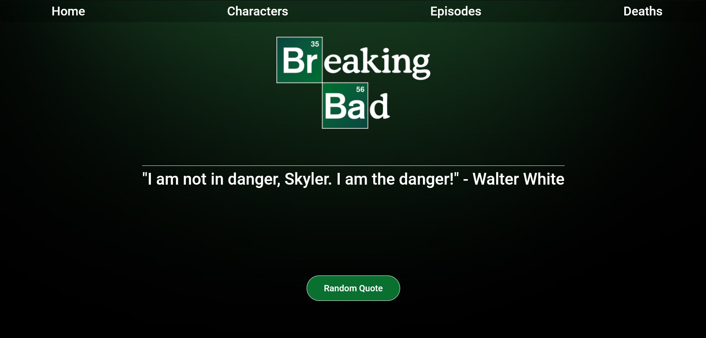

# breaking-bad-reactapp
Esta página web es mi primer proyecto de React, creada para poner en práctica los conocimientos que adquirí sobre el mismo en el bootcamp SoyHenry.
# Tecnologías
Tecnologías utilizadas para la realización de esta página web:
- React
- React-router-dom
- Redux-toolkit
- Font-awesome
- Axios
- Vite para la creación del template del proyecto.
- CCS3
#
Tiene cuatro navegaciones principales, Home, Characters, Episodes y Deaths. En cada una de ellas se puede observar distinta información de la serie, como por ejemplo, frases celebres de la serie, el nombre de los personajes, información sobre los personajes, los nombres de los episodios junto con su temporada, los nombres de los personajes muertos, etc. 

Preview de la home de la página web:

Cualquier opinión o critica sobre la misma, será bien recibida.